# 113-2-WM-Final-Project

# Dataset - H&M Kaggel
- [link of dataset](https://www.kaggle.com/competitions/h-and-m-personalized-fashion-recommendations/data
)

## Articles.csv 欄位說明

| 欄位名稱 | 中文名稱 | 範例 | 說明 |
|----------|-----------|------|------|
| `article_id` | 商品唯一編號 | `0108775015` | 每一件商品的唯一識別碼 |
| `product_code` | 商品主類別代碼 | `0108775` | 同一款商品的不同變化（如不同顏色）共用一個 `product_code` |
| `prod_name` | 商品名稱 | `Strap top` | 商品的基本命名 |
| `product_type_no` | 商品類型代碼 | `253` | 商品類型的數值編碼 |
| `product_type_name` | 商品類型名稱 | `Vest top` | 商品的類型名稱 |
| `product_group_name` | 商品群組名稱 | `Garment Upper body` | 所屬群組，如上身服飾、下身服飾等 |
| `graphical_appearance_no` | 外觀樣式代碼 | `1010016` | 圖形/樣式的數值編碼 |
| `graphical_appearance_name` | 外觀樣式名稱 | `Solid`, `Stripe` | 外觀樣式名稱，例如素色、條紋等 |
| `colour_group_code` | 顏色群組代碼 | `09` | 顏色編碼 |
| `colour_group_name` | 顏色名稱 | `Black`, `White` | 主觀分類的顏色名稱 |
| `perceived_colour_value_id` | 明暗色系代碼 | `4` | 商品顏色的亮度分類代碼 |
| `perceived_colour_value_name` | 明暗色系名稱 | `Dark`, `Light` | 顏色明暗分類名稱 |
| `perceived_colour_master_id` | 主色系代碼 | `5`, `9` | 感知主色的代碼 |
| `perceived_colour_master_name` | 主色系名稱 | `Black`, `White` | 主觀感知的主色名稱 |
| `department_no` | 部門代碼 | `1676` | 公司內部的部門代碼 |
| `department_name` | 部門名稱 | `Jersey Basic` | 商品所屬的部門名稱 |
| `index_code` | 分類索引代碼 | `A`, `B` | 銷售/分類索引代碼 |
| `index_name` | 分類索引名稱 | `Ladieswear` | 主分類名稱，如女裝 |
| `index_group_no` | 分類群組編號 | `1` | 分類群組代碼 |
| `index_group_name` | 分類群組名稱 | `Ladieswear` | 群組名稱 |
| `section_no` | 商品次分類代碼 | `16` | 更細的分類編號 |
| `section_name` | 商品次分類名稱 | `Womens Everyday Basics` | 商品次分類名稱 |
| `garment_group_no` | 服飾群組代碼 | `1002` | 更細分類的代碼 |
| `garment_group_name` | 服飾群組名稱 | `Jersey Basic`, `Under-, Nightwear` | 商品細分類名稱 |
| `detail_desc` | 商品描述 | `Jersey top with narrow shoulder straps.` | 商品詳細文字描述，可用於 NLP 處理 |

# articles.csv eda
> Dataset size：**105 542 rows × 25 columns**

## 1. 欄位概覽
| 欄位類型 | 數量 | 代表欄位 | 說明 |
|---------|------|----------|------|
| `int64` | 15   | `article_id‧product_code‧department_no` | 唯一 ID、層級代碼 |
| `object`| 10   | `prod_name‧product_type_name‧detail_desc` | 商品名稱、類別與敘述文字 |

## 缺失值  
- 僅 `detail_desc` 有 **0.39 %** 缺失，其餘欄位 **完整**。  

## 產品分布
| 指標 | Top-3 | 觀察 |
|------|-------|------|
| **產品種類** (`product_type_name`) | Trousers, Dress, Sweater | 下裝 & 洋裝為最大宗。 |
| **產品群組** (`product_group_name`) | Garment Upper body, Garment Lower body, Garment Full body | 上身衣物佔比最高，**~40 %**。 |
| **顏色 (群組)** | Black, Dark Blue, White | 深色調商品最受歡迎。 |
| **顏色 (Master)** | Black, Blue, White | 與群組趨勢一致，顯示配色命名一致性高。 |
| **圖案** (`graphical_appearance_name`) | Solid (單色) > All-over pattern >> Melange | 純色款數量遠高於其他圖案 (≈ 5 ×)。 |
| **Index（主線）** | Ladieswear > Divided > Menswear | **女性線**商品數量約為 Menswear 的 2 ×。 |
| **Section（次分類）** | Womens Everyday Collection, Divided Collection, Baby Essentials | 兒童線位居第三，可見童裝為 H&M 重要品類。 |
| **Garment group** | Jersey Fancy, Accessories, Jersey Basic | Jersey 類（針織上衣）橫跨 Fancy/Basics 兩塊，總量第一。 |
> 圖表：  
> 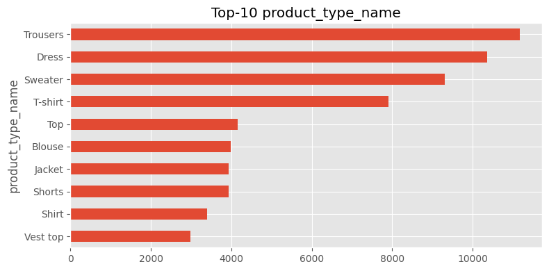  
> 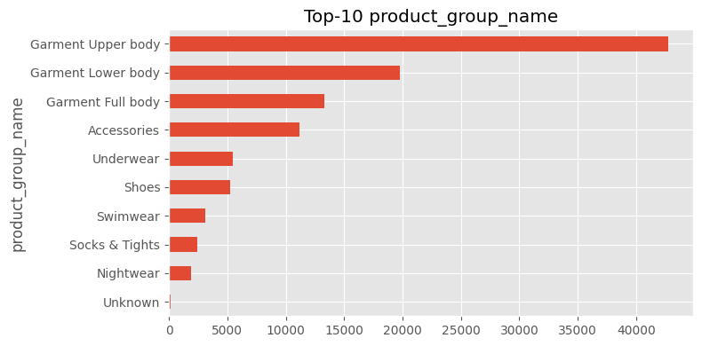

## 多維交叉分析

### 3.1 產品群組 × Index 熱力圖  
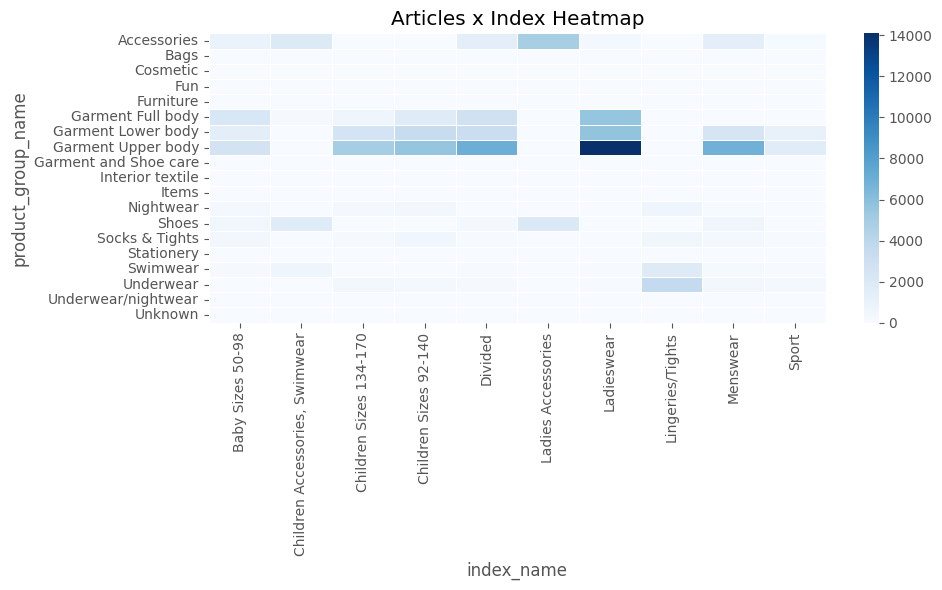

* `Ladieswear × Garment Upper body` 為高峰 (≈ 14 k)  
* `Divided` 與 `Children Sizes 92-140` 也集中於上身／全身服飾  
* `Menswear` 主要落在 `Garment Upper body`，下身比例低於男裝直覺，暗示供給策略偏重上衣。

### 3.2 圖案 × 顏色（前五大圖案）  

* 單色 (Solid) 幾乎在所有顏色都佔據壓倒性比例。  
* `Denim` 與 `Blue / Dark Blue` 高度重疊，如預期。  
* `Stripe` 在 **Light Blue**、**White** 出現高峰，符合彩條常見配色。

## 4. 文字特徵
* 商品名稱長度多數落在 **10–30 字**，右尾偏長。  
* 可考慮對 `prod_name` 做 **Token/TF-IDF** 或 **word2vec/fastText**，結合圖像特徵 (CLIP) 以提升冷啟動推薦。
> 圖表：  
> 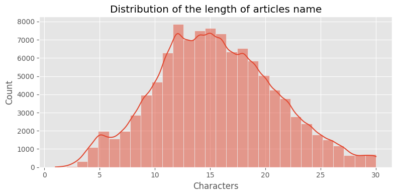  

## 5. 建議的後續工作
1. **價格 & 時間特性**  
   - 與 `transactions_train.csv` Join 取得 `price‧t_dat`，分析季節性與定價區間。  
   - 條件如：月份 × Index、黑色星期五 / 換季前後銷量變化。
2. **顏色／圖案 Embedding**  
   - 將 `colour_group_code‧graphical_appearance_no` one-hot 或類神經 Embedding，提供給召回模型。
3. **分層負採樣 (stratified)**  
   - 由於 **Garment Upper body**、**Solid** 等高度佔比，建議對長尾品類做加權或 over-sample，避免模型過度偏向熱門類別。  
4. **Cold-start 解決方案**  
   - 使用商品圖片 + 名稱文字抽取特徵，結合 meta-embedding，可對新上架商品提供 Top-k 候選。

# H&M — `transactions_train.csv` EDA 摘要  
> Dataset size：共計數千萬筆交易記錄，涵蓋 2018–2020 年間所有顧客購買紀錄。

---

## 1. 價格分布分析

### 📊 平均價格分布圖  
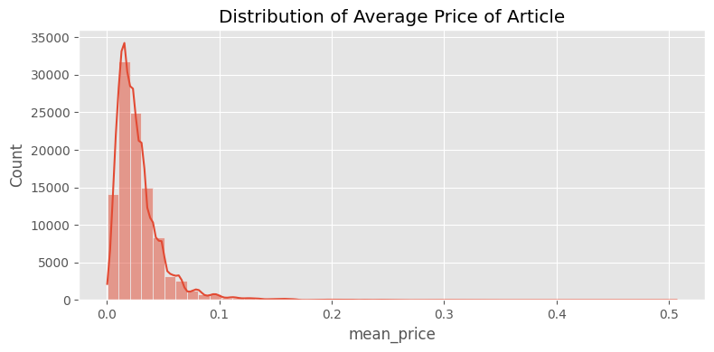

- 平均單品價格集中於 **0.01–0.05 區間 **，**峰值約 0.025–0.03**。
- 價格右尾極長，表示存在高價商品（如外套、鞋款）。
- 為避免偏態建議後續建模使用 **對數轉換 log(price)** 或 **Box-Cox/Quantile binning**。

---

## 2. 時間序列銷售趨勢

### 🧾 每月總銷售量  
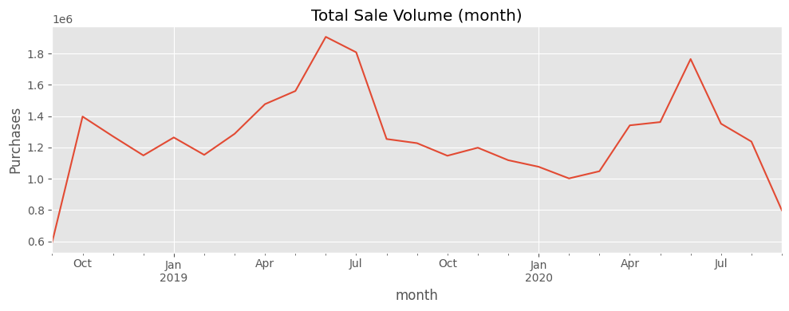

- **明顯的季節性波動**，每年 5–7 月與 11–12 月呈高峰，對應春夏與歲末購物季。
- 疫情初期（2020-Q1）有輕微衰退，但在 2020-Q2 反彈，整體彈性佳。
- `2020-09` 為測試區間（根據官方競賽規則），應避用作訓練。

---

## 3. 熱銷與冷門商品銷售趨勢

### 🔝 Top 100 商品月銷量  
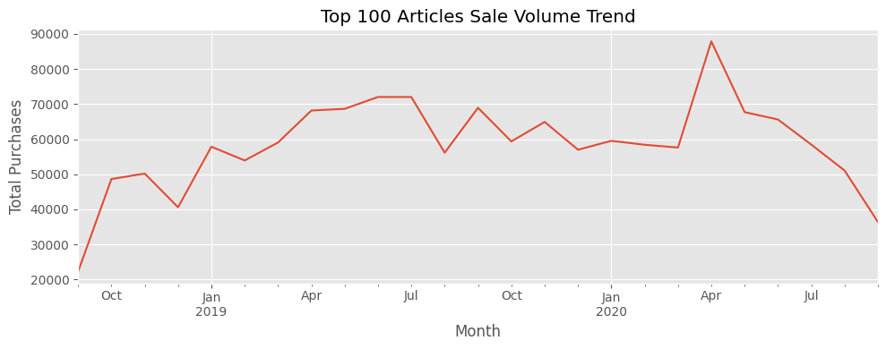

- 隨整體銷售波動而同步變動，顯示熱門商品符合季節性需求。
- 2020 年 4 月出現單月高峰，可能與春夏上新及線上推廣活動有關。

### 🔻 Least 100 商品月銷量  

- 大部分月銷量低於 10，幾近無銷售；存在長尾效應。
- 可考慮從推薦系統候選池中剔除或降低曝光機率，以提升 CTR/CVR。

---

## 4. 個別熱銷商品走勢

### 🔁 商品銷售 & 價格雙軸圖

#### 商品編號：706016001  
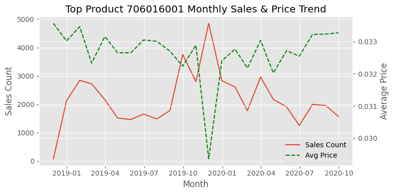

- 售價穩定，2019-Q4–2020-Q1 期間爆量，可能因活動推廣（促銷、主打款）。
- 可觀察此類「短期爆量型商品」是否具代表性，適合做 trigger-based 推薦。

#### 商品編號：706016002  
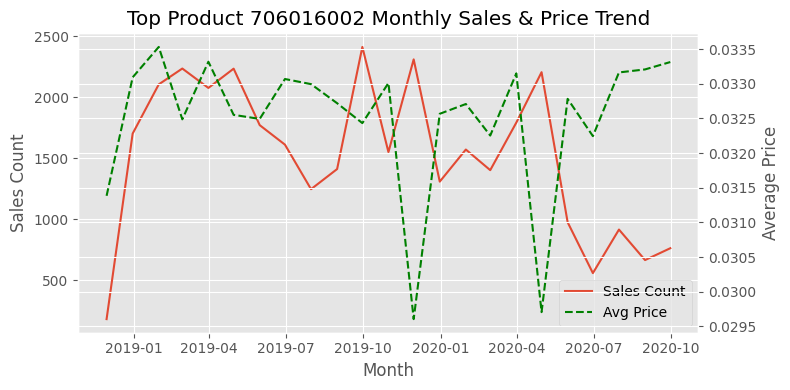

- 價格波動明顯高於 706016001，但銷售較穩定，推測為**週期性需求商品**（如童裝、內著）。

#### 商品編號：372860001  
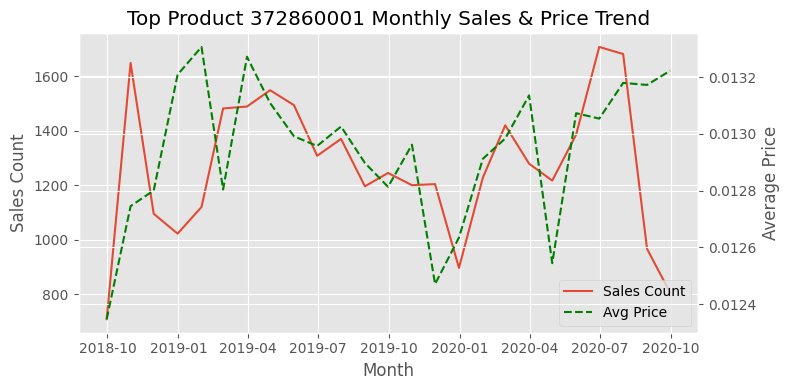

- 價格與銷量正相關，整體趨勢較平緩，屬於「常青型商品」。

---

## 5. 🔥 Top 10 商品熱力圖（依月 × article_id）

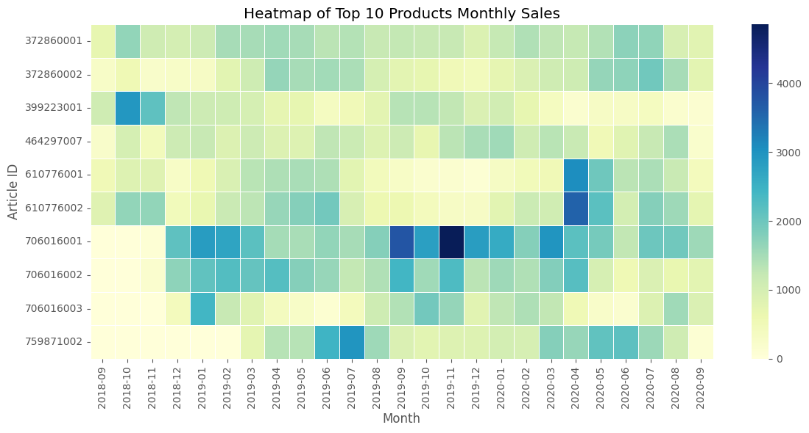

- 每款商品都有明顯銷售高峰期，多為 3–6 個月，支持「短週期時尚商品」特性。
- 例如 `706016001` 在 `2019-11` 達單月銷售 ≈ 4,800，遠高其他商品。
- 推薦系統應考慮**動態熱度權重**，非靜態平均數。

---

## 總結觀察

| 主題 | 洞察 |
|------|------|
| 📉 價格分布 | 單價集中在 0.03 SEK 附近，右偏極長尾。需轉換處理。 |
| 📆 銷售季節性 | 每年 5–7 月、11–12 月為高峰，具穩定週期性。 |
| 🔥 熱銷商品 | Top 100 明顯受季節與活動影響，應設計時間敏感型推薦策略。 |
| 🧊 冷門商品 | 長尾明顯，部分商品數月無銷售，建議剔除。 |
| 📈 價格影響 | 價格穩定度與銷售波動有關，建議將價格作為推薦模型的 feature。 |

# H&M — `session.csv` EDA 摘要（基於 transaction session 化後）

> ✅ 每筆紀錄代表一位顧客的「購物歷程（session）」，其結構為：  
> `customer_id` + `[(article_id, price, t_dat, sales_channel_id), …]`  
> 共計 **1,362,281 位顧客**，已轉換為 session 格式，進一步萃取以下特徵進行分析：

---

## 1. Session 統計總覽

| 指標             | 平均值         | 中位數     | 標準差      | 最大值     |
|------------------|----------------|------------|-------------|------------|
| 平均單價 avg_price (SEK)       | 0.0288         | 0.0261     | 0.0143      | 0.5068     |
| Session 跨日長度 session_span_days | 273 天         | 206 天     | 269 天      | 733 天     |
| 購買次數 sales_cnt             | 23.3 筆        | 9 筆       | 39.2 筆     | 1895 筆    |
| Session 長度 session_len       | 同上          | 同上       | 同上        | 同上       |

📌 **觀察：**
- 約 75% 使用者只購買 27 筆商品以下，屬於正常消費者群；但仍有極少數忠誠重複客戶達近 2000 筆。
- Session 時間跨度右偏長尾，有超過半年至一年以上購物紀錄的顧客，代表 H&M 存在穩定回購群體。

---

## 2. Session 長度分布  
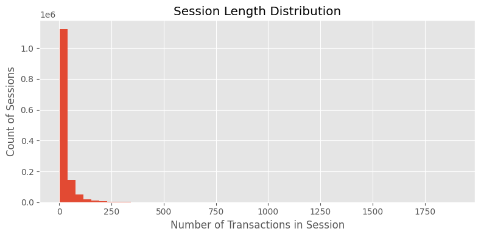

- 大多數 session 長度介於 **1~50 筆**；呈明顯的**長尾分布**。
- 須注意極長 session（>1000）可能為異常樣本，或需特殊建模處理（如將 session 拆分）。

---

## 3. Session 時間跨度分布  
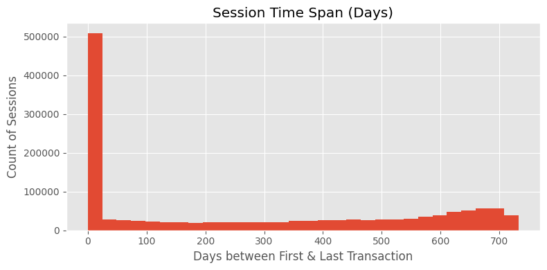

- 逾 **50 萬個顧客** 在同一天完成所有交易，顯示一日購物行為仍是主流（屬單次購物 session）。
- 其餘 session 時間跨度呈 bimodal，可能為 **活躍 vs. 回歸型顧客** 之分群線索。

---

## 4. Session 長度 vs. 平均價格關係  
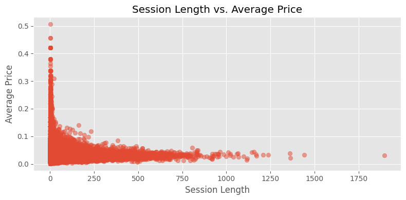

- 單價與 session 長度呈 **負相關趨勢**：
  - 長 session 的顧客傾向購買**單價較低商品**（如襪子、內著、配件），可能為大宗消費者。
  - 短 session 通常集中於中高單價商品，代表單次購買決策更謹慎。

---

## 5. 銷售通路分析

| 通路 ID | 說明     | 占比 (%)   |
|---------|----------|------------|
| 1       | 線上購物 | 29.6 %     |
| 2       | 實體門市 | **70.4 %** |

- 實體通路仍為 H&M 的主要收入來源。
- 可嘗試針對 sales_channel_id=1 的使用者行為進行更細緻分析（如是否有更高平均購物次數？）。

---

## 6. 建議後續應用方向

| 應用場景 | 建議 |
|----------|------|
| **推薦系統** | 將 `session_len`、`session_span_days` 作為使用者穩定度或忠誠度的 proxy；長期客戶可額外觸發活動推播。 |
| **分群分析** | 以 `session_len`, `avg_price`, `sales_cnt` 作為顧客 segmentation 特徵，導入 KMeans/GMM 建立用戶畫像。 |
| **異常偵測** | 極端長 session (> 500 筆) 可做 outlier handling 或建模遮罩（mask）處理，防止過度擬合少數大戶行為。 |
| **購買頻率建模** | 可由 session_span_days / session_len 近似「購買間隔」，作為 RFM 模型的 F 指標替代。 |

---

### 🔚 總結一句話

> **H&M 擁有大量單日交易用戶，同時也存在高忠誠大戶族群。需針對不同 session 長度/單價客群設計個性化推薦策略與異常處理邏輯。**

